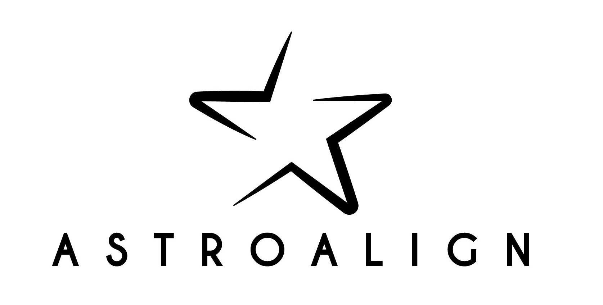

***

**ASTROALIGN** is a python module that will try to align two stellar astronomical images, especially when there is no WCS information available.

It does so by finding similar 3-point asterisms (triangles) in both images and deducing the affine transformation between them.

Generic registration routines try to match feature points, using corner
detection routines to make the point correspondence.
These generally fail for stellar astronomical images, since stars have very
little stable structure and so, in general, indistinguishable from each other.
Asterism matching is more robust, and closer to the human way of matching stellar images.

Astroalign can match images of very different field of view, point-spread function, seeing and atmospheric conditions.

It may not work, or work with special care, on images of extended objects with few point-like sources or in very crowded fields.

You can find a Jupyter notebook example with the main features at [http://quatrope.github.io/astroalign/](http://quatrope.github.io/astroalign/).

**Full documentation:** https://astroalign.readthedocs.io/

***

## Installation

Using setuptools:

    $ pip install astroalign

or from this distribution with

    $ python setup.py install

***

## Usage example

    >>> import astroalign as aa
    >>> aligned_image, footprint = aa.register(source_image, target_image)

In this example `source_image` will be interpolated by a transformation to coincide pixel to pixel with `target_image` and stored in `aligned_image`.

If we are only interested in knowing the transformation and the correspondence of control points in both images, use `find_transform` will return the transformation in a [Scikit-Image](https://scikit-image.org/) `SimilarityTransform` object and a list of stars in source with the corresponding stars in target.

    >>> transf, (s_list, t_list) = aa.find_transform(source, target)

`source` and `target` can each either be the numpy array of the image (grayscale or color),
or an iterable of (x, y) pairs of star positions on the image.

The returned `transf` object is a scikit-image [`SimilarityTranform`](http://scikit-image.org/docs/dev/api/skimage.transform.html#skimage.transform.SimilarityTransform) object that contains the transformation matrix along with the scale, rotation and translation parameters.

`s_list` and `t_list` are numpy arrays of (x, y) point correspondence between `source` and `target`. `transf` applied to `s_list` will approximately render `t_list`.

***

## Citation

If you use astroalign in a scientific publication, we would appreciate citations to the following [paper](https://www.sciencedirect.com/science/article/pii/S221313372030038X):

    Astroalign: A Python module for astronomical image registration.
    Beroiz, M., Cabral, J. B., & Sanchez, B.
    Astronomy & Computing, Volume 32, July 2020, 100384.

***

TOROS Dev Team

<martinberoiz@gmail.com>
