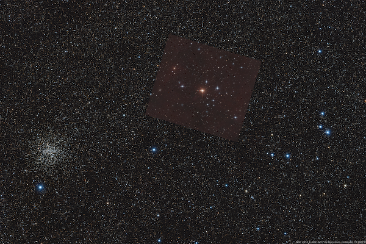

.. _mask:

Selecting regions with masking
==============================

If you want to restrict the source search to regions in any of the images, you can mask the undesired regions out before passing them.

This can be useful if the field of views are very different and you want to restrict the search only where the images overlap.

It can also be useful to mask out objects below the horizon; extended objects like galaxies; or very dense globular clusters.

Below are some examples.

Masking out undesired regions
-----------------------------

If you are in a situation where you know the approximate region that the ``source`` image will occupy in the ``target`` image
but the images themselves are not similar enough, you can restrict the search to the region of interest (ROI.)

Suppose you have two images of about the same region in the sky.
The first image is  about 2 degrees and the second is half a degree field of view.

.. figure:: /images/mask_tutorial/target_region.png
    :height: 200px

    **Image 1**\: Target image of about 2 square degree field of view, with an inset of the approximate region covered by the source image. (Image by `Gary Imm <http://www.garyimm.com>`_, used with permission.)

.. figure:: /images/mask_tutorial/source_half_degree.png
    :height: 200px

    **Image 2**: Source image of about 0.5 square degree field of view.

Finding out the ROI can be a whole problem of itself, but for this example let's suppose we know it roughly corresponds to the
ROI from rows 300--900 and columns 1000--1700 in all 3 color channels.

    >>> mask = np.ones_like(target, dtype="bool")
    >>> mask[300:900,1000:1700,:] = False  # ROI
    >>> target_masked = np.ma.array(target, mask=mask)
    >>> registered, footprint = aa.register(source, target_masked)

Just to show one application to the process above, let's overwrite the target by the registered source image in the footprint pixels.

    >>> target[~footprint] = registered[~footprint]

The target image should now look like below.

